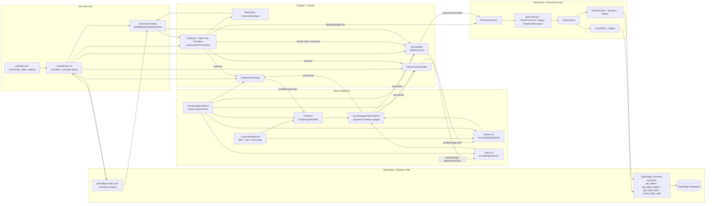

# ProBro One-Page Architecture Diagram

Date: 2026-05-31

Context: This diagram summarizes the main runtime parts of the `src` folder and the message/data flow between the VS Code extension host, tree views, React webviews, and OpenEdge access layer.

## Diagram

## Reading Guide

1. Start at `package.json` and `src/extension.ts` to understand what VS Code contributes and activates.
2. Follow `src/treeview/TablesListProvider.ts` to see how table selection loads and pushes data into Fields and Indexes webviews.
3. Read `src/webview/PanelViewProvider.ts` and `src/webview/QueryEditor.ts` to understand extension-host to webview messaging.
4. Read `src/view/app/model.ts` before deeper UI work because it defines the command and data contracts used on both sides.
5. Follow `src/repo/processor/ProcessorFactory.ts` into `src/repo/processor/database/DbProcessor.ts` and `src/repo/client/*` to see where database requests are actually executed.

## Core Ideas

- The extension host owns VS Code integration, state, commands, and provider registration.
- Tree providers decide what database/table node is active and trigger data loading.
- Webviews are separate browser contexts running React, and they only talk to the extension through message passing.
- Shared models in `src/view/app/model.ts` are the contract boundary between the extension code and the React code.
- The processor/client layer isolates database communication details from UI and VS Code concerns.